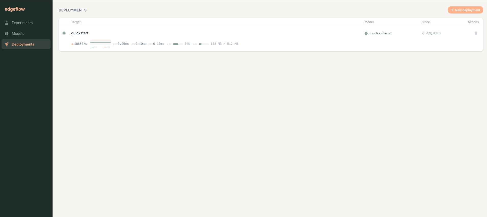

# Edgeflow

Train in Python. Serve in Rust.

[](https://github.com/jordandelbar/edgeflow/actions/workflows/ci.yml)
[](https://crates.io/crates/edgeflow-cli)
[](https://pypi.org/project/edgeflow/)
[](LICENSE)
[](Cargo.toml)

Edgeflow is an MLflow-compatible experiment tracker, model registry, and
inference server, built for people who can't afford the memory tax of a
Python serving stack. Models run as ONNX (ort or tract), pre/post
processing runs as WASM, and deployments hot-swap without downtime.



## What you get

- MLflow-compatible tracking and model registry
- ONNX inference (ort or tract backend)
- Hot-swap deploys with no downtime
- WASM pre/post processing
- Runs on Kubernetes (multi target deployments) or plain docker-compose (single target deployment)
- OpenTelemetry metrics and traces out of the box

## Demo Quickstart

Bring up a local server and one inference pod:

```bash
curl -O https://raw.githubusercontent.com/jordandelbar/edgeflow/main/deploy/quickstart.yaml
docker compose -f quickstart.yaml up
```

In another shell, train and deploy an iris classifier:

```bash
curl -O https://raw.githubusercontent.com/jordandelbar/edgeflow/main/examples/01-quickstart-iris/train.py
uv run train.py
```

Then call it:

```bash
curl -X POST http://localhost:8080/infer \
     -H 'Content-Type: application/json' \
     -d '[5.1, 3.5, 1.4, 0.2]'
# {"class_id":0,"label":"setosa","confidence":0.9766}
```

The compose path runs a single inference pod. Any target name works,
but only the latest deployment is active at a time. Multi-target
deployments, rolling upgrades, and resource patching require the
Kubernetes path.
